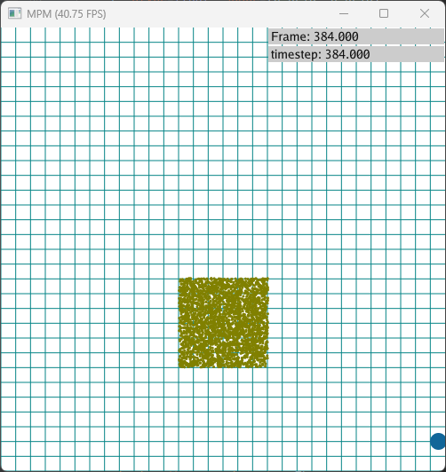

# MPM
このプロジェクトはMaterial Point Method（物質点法）をPythonのTaichiというフレームワークを用いて，実装した簡易的なシミュレーションです．

## MPMとは
CGの分野における流体力学の知識を応用したシミュレーション方法の一つです．
何か物体をコンピュータ上でシミュレーションする場合，その物体を連続体として扱う方法が存在します．流体の動きに対して，空間上に領域を分割するような格子を張り，格子点で計算する格子法と無数の粒子で構成し，計算する粒子法，この二つの手法からなる PIC(Particle-In-Cell)やFLIP(Fluid Implicit Particle Method) という手法が提案されました．さらに PIC と FLIP を補完しあった PIC/FLIPという手法も提案されました．これらは流体力学で用いられる数値計算法ですが，弾性体や塑性体を再現するために固体力学に流用した MPM(Material Point Method)が開発
されました．


### Step1:
領域内に背景格子を張り，速度や質量等の物理量は粒子に持たせる．

### Step2:
粒子が持つ物理量を各格子点に補間する．

### Step3:
格子点で更新のための数値計算をする．

### Step4:
計算結果を粒子に補間し，変形を粒子に適応させる．


## プロジェクト説明
*mpm.py*と*stencil.py*はそれぞれが独立したものとなっており，異なるシミュレーションになっています．*stencil.py*では，MPMの無駄な計算を省くための改良を行い，実行速度が高性能化されています．しかし，基本的な実行結果は同じです．

## シミュレーション内容・実行例
以下にプロジェクトの実行例を示します．
本プロジェクトでは，MPMの基本的な2次元シミュレーションを行うために，物体の自由落下という状況を想定しています．また，そのほかにも力のかかる向きを任意の方向に変化させることも可能です．



実行画面にある通り，物体を点の集合を表し，自由落下をシミュレーションしています．

## インストールと使用法
本プロジェクトでは，Pythonベースのプログラミング言語とフレームワークであり、高性能な数値計算と物理シミュレーションを行うために設計された*Taichi*を使用します．*Taichi*は、GPUを活用して高速なシミュレーションや視覚化を行うことができることが特徴です．
https://github.com/taichi-dev/taichi

```
pip install taichi
```

## License
This project is released under the MIT License.
